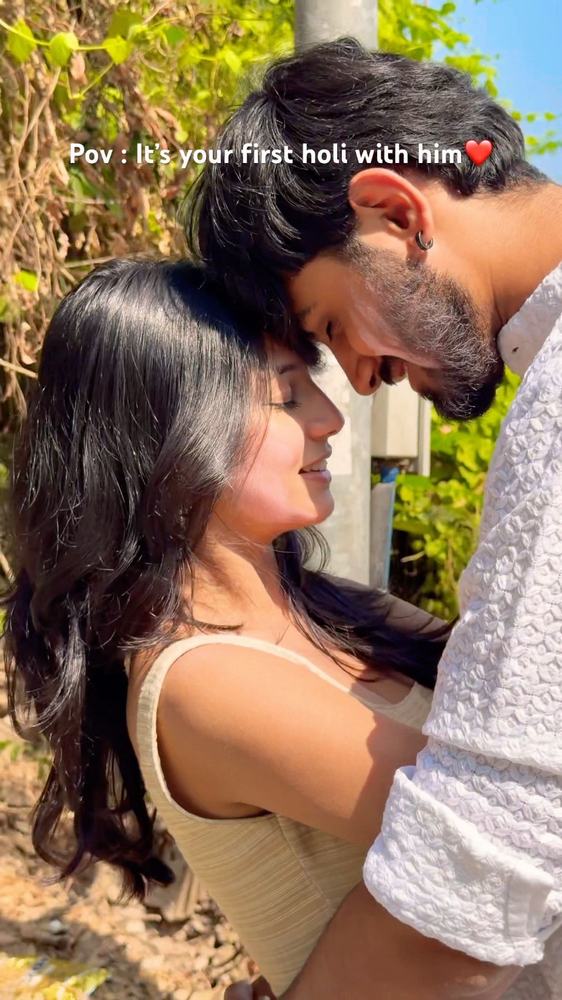

# YouTube Short - Ejzel7VfnMI

## Title

The best start to holi🥹 #coupleshorts #viralvideo #viralshorts #holi #coupleholi #viralshort #love

## Thumbnail & Video

<section>
  
  
  <iframe
    src="https://www.youtube.com/embed/Ejzel7VfnMI"
    title="The best start to holi🥹 #coupleshorts #viralvideo #viralshorts #holi #coupleholi #viralshort #love"
    frameborder="0"
    allow="accelerometer; autoplay; clipboard-write; encrypted-media; gyroscope; picture-in-picture; web-share"
    referrerpolicy="strict-origin-when-cross-origin"
    allowfullscreen
  ></iframe>
</section>

## Info

- **YouTube Channel:** [@mishti.mehtaa](https://www.youtube.com/@mishti.mehtaa)
- **Date Published:** Mar 3, 2026
- **Description:** The best start to holi🥹 #coupleshorts #viralvideo #viralshorts #holi #coupleholi #viralshort #love

## Summary

You’ve captured the essence beautifully. Let me refine and expand your interpretation a bit:

### 🌸 What the Picture Says

The text _“Pov: It’s your first holi with him ❤️”_ uses the **POV (Point of View)** framing to immerse the viewer in the woman’s experience.

- **Context:** It’s about the emotional milestone of celebrating Holi—the festival of colors—for the first time as a couple.
- **Sentiment:** The red heart emoji amplifies the romantic undertone, suggesting joy, affection, and the beginning of a shared journey.
- **Symbolism:** Holi itself represents renewal, unity, and playfulness, so the caption ties the couple’s bond to the cultural meaning of the festival.

### 💞 What the Pose is Called

The pose is intimate and symbolic, often described in photography and cultural contexts as:

- **Forehead Touch / Head-to-Head:** A classic romantic gesture where partners lean in to touch foreheads. It conveys trust, vulnerability, and emotional synchronization—sometimes poetically called _“kissing the soul.”_
- **Soft Connection / Intimate Lean:** In portrait photography, this pose emphasizes closeness without overt physicality, highlighting tenderness and comfort.
- **Cultural Parallels:** Similar gestures exist worldwide—like the Māori **Hongi** or Hawaiian **Honi**, where foreheads and noses touch to share the “breath of life.” Here, it’s adapted into a romantic context.

---

✨ In short: the text sets the emotional stage of a first Holi together, while the **forehead-touch pose** visually communicates intimacy, trust, and a soulful bond.

Would you like me to show you a few other **romantic couple poses** that photographers often use during Holi celebrations—like playful color throws or candid laughter moments?

### Markdown to HTML

[MD2HTML](https://convertmarkdowntohtml.com/) Or https://convertmarkdowntohtml.com/
